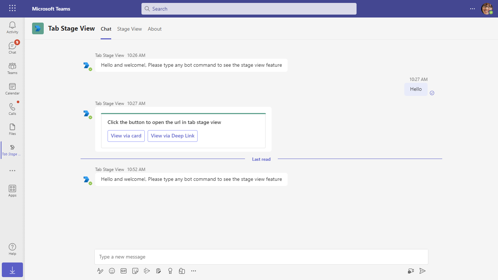

# Stage View

This App talks about the Teams tab in stage view with Nodejs.
For reference please check [Tabs link unfurling and Stage View](https://docs.microsoft.com/microsoftteams/platform/tabs/tabs-link-unfurling)

## Included Features
* Bots
* Stage View (tabs)

## Interaction with app


## Try it yourself - experience the App in your Microsoft Teams client
Please find below demo manifest which is deployed on Microsoft Azure and you can try it yourself by uploading the app package (.zip file link below) to your teams and/or as a personal app. (Sideloading must be enabled for your tenant, [see steps here](https://docs.microsoft.com/microsoftteams/platform/concepts/build-and-test/prepare-your-o365-tenant#enable-custom-teams-apps-and-turn-on-custom-app-uploading)).

**Stage View:** [Manifest](/samples/tab-stage-view/csharp/demo-manifest/tab-stage-view.zip)

## Prerequisites

- Office 365 tenant. You can get a free tenant for development use by signing up for the [Office 365 Developer Program](https://developer.microsoft.com/microsoft-365/dev-program).

- To test locally, [NodeJS](https://nodejs.org/en/download/) must be installed on your development machine (version 16.14.2 or higher).

    ```bash
    # determine node version
    node --version
    ```

- To test locally, you'll need [Ngrok](https://ngrok.com/) installed on your development machine.
    Make sure you've downloaded and installed Ngrok on your local machine. ngrok will tunnel requests from the Internet to your local computer and terminate the SSL connection from Teams.

## Setup

> NOTE: The free ngrok plan will generate a new URL every time you run it, which requires you to update your Azure AD registration, the Teams app manifest, and the project configuration. A paid account with a permanent ngrok URL is recommended.

1) Setup for Bot
    - Register Azure AD application
    - Register a bot with Azure Bot Service, following the instructions [here](https://docs.microsoft.coms/azure/bot-service/bot-service-quickstart-registration?view=azure-bot-service-3.0).
    - While registering the bot, use `https://<your_ngrok_url>/api/messages` as the messaging endpoint.
   
    > NOTE: When you create your app registration in Azure portal, you will create an App ID and App password - make sure you keep these for later.

2) Setup NGROK
- Run ngrok - point to port `3978`

    ```bash
    ngrok http 3978 --host-header="localhost:3978"
    ```

3) Setup for code    
- Clone the repository

    ```bash
    git clone https://github.com/OfficeDev/Microsoft-Teams-Samples.git
    ```

- In a console, navigate to `samples/tab-stage-view/nodejs` folder

- Install modules

    ```bash
    npm install
    ```

- Update the `.env` configuration for the bot to use the `MicrosoftAppId` (Microsoft App Id) and `MicrosoftAppPassword` (App Password) from the Azure bot registration in Azure portal or Bot Framework registration. 
Also update `BaseUrl` according to your code runtime environment.
> NOTE: the App Password is referred to as the `client secret` in the azure portal and you can always create a new client secret anytime.

- Run your bot at the command line:

    ```bash
    npm start
    ```
- Install modules & Run the NodeJS Server
  - Server will run on PORT: 3978
  - Open a terminal and navigate to project root directory
 
    ```bash
    npm run server
    ```
- This command is equivalent to: npm install > npm start

- Setup Manifest for Teams
4) **This step is specific to Teams.**

   -  Edit the `manifest.json` in the `Manifest` folder and replace the following details:
   - `<<MANIFEST-ID>>` with some unique GUID or `MicrosoftAppId`
   - `<<BASE-URL>>` with your application's base url, e.g. https://1234.ngrok-free.app
   - `<<YOUR-MICROSOFT-APP-ID>>` with the `MicrosoftAppId` received from AAD app registration in Azure portal.
   - `<<DOMAIN-NAME>>` with the ngrok URL or app hosted base url.
   **Note:** If you want to test your app across multi hub like: Outlook/Office.com, please update the `manifest.json` in the `tab-stage-view\nodejs\Manifest_Hub` folder with the required values.
   - **Zip** up the contents of the `Manifest` folder to create a `Manifest.zip` or `Manifest_Hub` folder to create a `Manifest_Hub.zip`
   - **Upload** the `manifest.zip` to Teams (in the Apps view click "Upload a custom app")
         - Go to Microsoft Teams. From the lower left corner, select Apps
         - From the lower left corner, choose Upload a custom App
         - Go to your project directory, the ./Manifest folder, select the zip folder, and choose Open.
         - Select Add in the pop-up dialog box. Your tab is uploaded to Teams.

**Note**: If you are facing any issue in your app, please uncomment [this](https://github.com/OfficeDev/Microsoft-Teams-Samples/blob/main/samples/tab-stage-view/nodejs/server/api/botController.js#L24) line and put your debugger for local debug..

## Running the sample
- In the navigation bar located at the far left in Teams, select the ellipses ●●● and choose your app from the list.

**Welcome message with feature explanation and Adaptive Card with actions:**



**Opening Collaborative Stage View**. Please refer [Collaborative Stage view](https://review.learn.microsoft.com/en-us/microsoftteams/platform/tabs/tabs-link-unfurling?branch=pr-en-us-7891#collaborative-stage-view) for more details


**Opening stage view from Adaptive card via deep link:**


**Opening stage view from unfurling link. If you copy and paste a link from https://www.BotFramework.com into the compose message area the link will unfurl.**


**Tab with execute deep link action to open stage view:**

         

## Outlook on the web

- To view your app in Outlook on the web.

- Go to [Outlook on the web](https://outlook.office.com/mail/)and sign in using your dev tenant account.

**On the side bar, select More Apps. Your sideloaded app title appears among your installed apps**


**Select your app icon to launch and preview your app running in Outlook on the web**


**Note:** Similarly, you can test your application in the Outlook desktop app as well.

## Office on the web

- To preview your app running in Office on the web.

- Log into office.com with test tenant credentials

**Select the Apps icon on the side bar. Your sideloaded app title appears among your installed apps**


**Select your app icon to launch your app in Office on the web**

 

**After opening Outlook web, click the "New mail" button.**


**On the tool bar on top, select Apps icon. Your sideloaded app title appears among your installed apps**


**Opening stage view from unfurling link. If you copy and paste a link from https://www.BotFramework.com into the compose message area the link will unfurl.**


**Note:** Similarly, you can test your application in the Office 365 desktop app as well.

## Deploy the bot to Azure

To learn more about deploying a bot to Azure, see [Deploy your bot to Azure](https://aka.ms/azuredeployment) for a complete list of deployment instructions.
- Ensure that you've [enabled the Teams Channel](https://docs.microsoft.com/azure/bot-service/channel-connect-teams?view=azure-bot-service-4.0)

## Further reading

- [Tabs](https://learn.microsoft.com/microsoftteams/platform/tabs/what-are-tabs)
- [Stage view](https://learn.microsoft.com/microsoftteams/platform/tabs/tabs-link-unfurling#stage-view)

