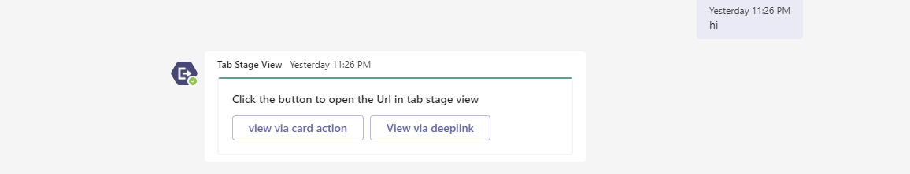
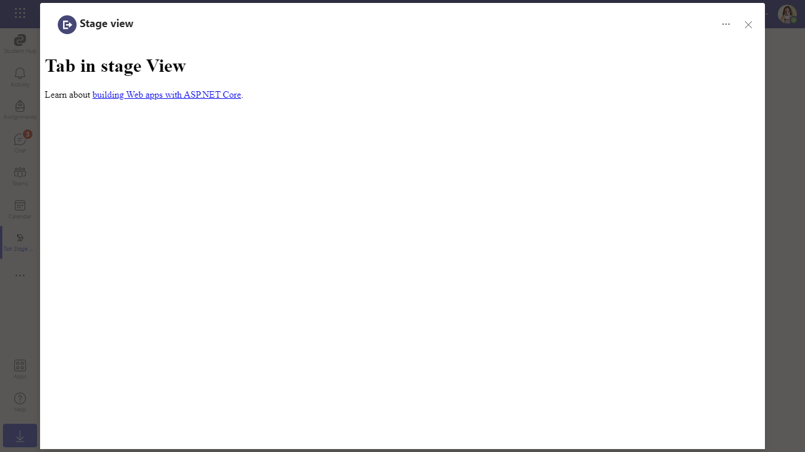

# Stage View

This App talks about the Teams tab in stage view with Nodejs.
For reference please check [Tabs link unfurling and Stage View](https://docs.microsoft.com/en-us/microsoftteams/platform/tabs/tabs-link-unfurling)


## Key features

- Welcome message with feature explanation.


- Adaptive Card with actions.



- Opening stage view from Adaptive Card Action.



- Opening stage view from Adaptive card via deep link.


- Tab with execute deep link action to open stage view.


## Prerequisites

1. Office 365 tenant. You can get a free tenant for development use by signing up for the [Office 365 Developer Program](https://developer.microsoft.com/en-us/microsoft-365/dev-program).

2. To test locally, [NodeJS](https://nodejs.org/en/download/) must be installed on your development machine (version 10.14 or higher).

    ```bash
    # determine node version
    node --version
    ```

3. To test locally, you'll need [Ngrok](https://ngrok.com/) installed on your development machine.
Make sure you've downloaded and installed Ngrok on your local machine. ngrok will tunnel requests from the Internet to your local computer and terminate the SSL connection from Teams.

> NOTE: The free ngrok plan will generate a new URL every time you run it, which requires you to update your Azure AD registration, the Teams app manifest, and the project configuration. A paid account with a permanent ngrok URL is recommended.

## To try this sample

- Register Azure AD applications
    -   Register your bot using bot channel registration in Azure AD portal, following the instructions [here](Wiki/azure-bot-channels-registration.md).
    
- Clone the repository

    ```bash
    git clone https://github.com/OfficeDev/Microsoft-Teams-Samples.git
    ```

- In a console, navigate to `samples/tab-stage-view/nodejs`

    ```bash
    cd samples/tab-stage-view/nodejs
    ```

- Run ngrok - point to port `3978`

    ```bash
    ngrok http -host-header=localhost 3978
    ```


- Update the `.env` configuration for the bot to use the `MicrosoftAppId` (Microsoft App Id) and `MicrosoftAppPassword` (App Password) from the Bot Framework registration. 
Also update `BaseUrl` according to your code runtime environment.
> NOTE: the App Password is referred to as the `client secret` in the azure portal and you can always create a new client secret anytime.

- Install modules & Run the `NodeJS` Server 
    - Server will run on PORT:  `3978`
    - Open a terminal and navigate to project root directory
    
    ```bash
    npm run server
    ```
    
    > **This command is equivalent to:**
    _npm install  > npm start_

- __*This step is specific to Teams.*__
    **Edit** the `manifest.json` in the `appPackage` folder and replace the following details:
   - `<<MANIFEST-ID>>` with some unique GUID   
   - `<<BASE-URL>>` with your application's base url, e.g. https://1234.ngrok.io
   - `<<YOUR-MICROSOFT-APP-ID>>` with the `MicrosoftAppId`. 
   - `<<DOMAIN-NAME>>` with the ngrok URL or app hosted base url.
    - **Zip** up the contents of the `appPackage` folder to create a `manifest.zip`
    - **Upload** the `manifest.zip` to Teams (in the Apps view click "Upload a custom app")
         - Go to Microsoft Teams. From the lower left corner, select Apps
         - From the lower left corner, choose Upload a custom App
         - Go to your project directory, the ./appPackage folder, select the zip folder, and choose Open.
         - Select Add in the pop-up dialog box. Your tab is uploaded to Teams.

## Interacting with the bot in Teams

You can use this tab by following the below steps:
- In the navigation bar located at the far left in Teams, select the ellipses ●●● and choose your app from the list.

## Deploy the bot to Azure

To learn more about deploying a bot to Azure, see [Deploy your bot to Azure](https://aka.ms/azuredeployment) for a complete list of deployment instructions.
- Ensure that you've [enabled the Teams Channel](https://docs.microsoft.com/en-us/azure/bot-service/channel-connect-teams?view=azure-bot-service-4.0)

## Further reading

- [Bot Framework Documentation](https://docs.botframework.com)
- [Bot Basics](https://docs.microsoft.com/azure/bot-service/bot-builder-basics?view=azure-bot-service-4.0)
- [User Specific Views](https://docs.microsoft.com/en-us/microsoftteams/platform/task-modules-and-cards/cards/universal-actions-for-adaptive-cards/user-specific-views)
- [Sequential Workflows](https://docs.microsoft.com/en-us/microsoftteams/platform/task-modules-and-cards/cards/universal-actions-for-adaptive-cards/sequential-workflows)
- [Up to date cards](https://docs.microsoft.com/en-us/microsoftteams/platform/task-modules-and-cards/cards/universal-actions-for-adaptive-cards/up-to-date-views)
- [Universal Bot Action Model](https://docs.microsoft.com/en-us/adaptive-cards/authoring-cards/universal-action-model#actionexecute)
- [Azure Portal](https://portal.azure.com)
- [Activity processing](https://docs.microsoft.com/en-us/azure/bot-service/bot-builder-concept-activity-processing?view=azure-bot-service-4.0)
- [Azure Bot Service Introduction](https://docs.microsoft.com/azure/bot-service/bot-service-overview-introduction?view=azure-bot-service-4.0)
- [Azure Bot Service Documentation](https://docs.microsoft.com/azure/bot-service/?view=azure-bot-service-4.0)
- [Azure CLI](https://docs.microsoft.com/cli/azure/?view=azure-cli-latest)
- [Azure Portal](https://portal.azure.com)
- [Language Understanding using LUIS](https://docs.microsoft.com/en-us/azure/cognitive-services/luis/)
- [Channels and Bot Connector Service](https://docs.microsoft.com/en-us/azure/bot-service/bot-concepts?view=azure-bot-service-4.0)
- [dotenv](https://www.npmjs.com/package/dotenv)
- [Microsoft Teams Developer Platform](https://docs.microsoft.com/en-us/microsoftteams/platform/)
