# Stage View

This sample app showcases the capabilities of Microsoft Teams tabs in stage view using Node.js and the Microsoft 365 Agents SDK. It demonstrates collaborative features such as multi-window support and interactive elements, allowing users to engage dynamically through adaptive cards and deep linking for a richer experience in Teams.

For reference please check [Tabs link unfurling and Stage View](https://docs.microsoft.com/microsoftteams/platform/tabs/tabs-link-unfurling)

## Included Features
* Bots (using Microsoft 365 Agents SDK)
* Stage View (tabs)
* Collaborative Stageview
* Stageview Multi-window (PopOut)
* Stageview Modal
* Link Unfurling

## Interaction with app

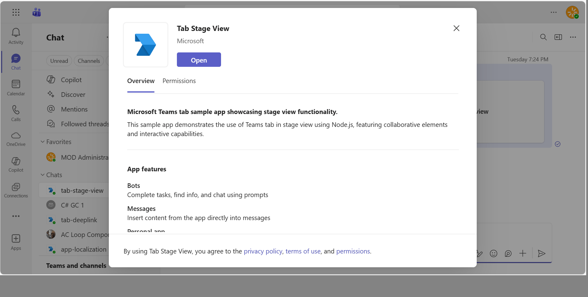

## Try it yourself - experience the App in your Microsoft Teams client
Please find below demo manifest which is deployed on Microsoft Azure and you can try it yourself by uploading the app package (.zip file link below) to your teams and/or as a personal app. (Uploading must be enabled for your tenant, [see steps here](https://docs.microsoft.com/microsoftteams/platform/concepts/build-and-test/prepare-your-o365-tenant#enable-custom-teams-apps-and-turn-on-custom-app-uploading)).

**Stage View:** [Manifest](/samples/tab-stage-view/csharp/demo-manifest/tab-stage-view.zip)

## Prerequisites

- Office 365 tenant. You can get a free tenant for development use by signing up for the [Office 365 Developer Program](https://developer.microsoft.com/microsoft-365/dev-program).

- To test locally, [NodeJS](https://nodejs.org/en/download/) must be installed on your development machine (version 16.14.2 or higher).

    ```bash
    # determine node version
    node --version
    ```

- [dev tunnel](https://learn.microsoft.com/en-us/azure/developer/dev-tunnels/get-started?tabs=windows) or [Ngrok](https://ngrok.com/download) (For local environment testing) latest version (any other tunneling software can also be used)
   If you using Ngrok to test locally, you'll need [Ngrok](https://ngrok.com/) installed on your development machine.
Make sure you've downloaded and installed Ngrok on your local machine. ngrok will tunnel requests from the Internet to your local computer and terminate the SSL connection from Teams.

- [Microsoft 365 Agents Toolkit for VS Code](https://marketplace.visualstudio.com/items?itemName=TeamsDevApp.ms-teams-vscode-extension) or [TeamsFx CLI](https://learn.microsoft.com/microsoftteams/platform/toolkit/teamsfx-cli?pivots=version-one)

## Run the app (Using Microsoft 365 Agents Toolkit for Visual Studio Code)

The simplest way to run this sample in Teams is to use Microsoft 365 Agents Toolkit for Visual Studio Code.

1. Ensure you have downloaded and installed [Visual Studio Code](https://code.visualstudio.com/docs/setup/setup-overview)
1. Install the [Microsoft 365 Agents Toolkit extension](https://marketplace.visualstudio.com/items?itemName=TeamsDevApp.ms-teams-vscode-extension)
1. Select **File > Open Folder** in VS Code and choose this samples directory from the repo
1. Using the extension, sign in with your Microsoft 365 account where you have permissions to upload custom apps
1. Select **Debug > Start Debugging** or **F5** to run the app in a Teams web client.
1. In the browser that launches, select the **Add** button to install the app to Teams.

> If you do not have permission to upload custom apps (uploading), Microsoft 365 Agents Toolkit will recommend creating and using a Microsoft 365 Developer Program account - a free program to get your own dev environment sandbox that includes Teams.

## Setup

> NOTE: The free ngrok plan will generate a new URL every time you run it, which requires you to update your Azure AD registration, the Teams app manifest, and the project configuration. A paid account with a permanent ngrok URL is recommended.

1) Setup for Bot
    - Register a bot with Azure Bot Service, following the instructions [here](https://docs.microsoft.com/azure/bot-service/bot-service-quickstart-registration?view=azure-bot-service-3.0).
    - While registering the bot, use `https://<your_tunnel_domain>/api/messages` as the messaging endpoint.
   
    > NOTE: When you create your app registration in Azure portal, you will create an App ID and App password - make sure you keep these for later.

2) App Registration

### Register your application with Azure AD

1. Register a new application in the [Microsoft Entra ID – App Registrations](https://go.microsoft.com/fwlink/?linkid=2083908) portal.
2. Select **New Registration** and on the *register an application page*, set following values:
    * Set **name** to your app name.
    * Choose the **supported account types** (any account type will work)
    * Leave **Redirect URI** empty.
    * Choose **Register**.
3. On the overview page, copy and save the **Application (client) ID, Directory (tenant) ID**. You'll need those later when updating your Teams application manifest and in the appsettings.json.
4. Navigate to **API Permissions**, and make sure to add the follow permissions:
    * Select Add a permission
    * Select Microsoft Graph -> Delegated permissions.
    * `User.Read` (enabled by default)
    * Click on Add permissions. Please make sure to grant the admin consent for the required permissions.

3) Setup NGROK
1) Run ngrok - point to port 3978

   ```bash
   ngrok http 3978 --host-header="localhost:3978"
   ```  

   Alternatively, you can also use the `dev tunnels`. Please follow [Create and host a dev tunnel](https://learn.microsoft.com/en-us/azure/developer/dev-tunnels/get-started?tabs=windows) and host the tunnel with anonymous user access command as shown below:

   ```bash
   devtunnel host -p 3978 --allow-anonymous
   ```

4) Setup for code    
- Clone the repository

    ```bash
    git clone https://github.com/OfficeDev/Microsoft-Teams-Samples.git
    ```

- In a console, navigate to `samples/tab-stage-view/nodejs` folder

- Install modules

    ```bash
    npm install
    ```

- Update the `.env` configuration for the bot to use the `clientId` (Microsoft App Id) and `clientSecret` (App Password) from the Azure bot registration in Azure portal.
Also update `BaseUrl` according to your code runtime environment.
> NOTE: the App Password is referred to as the `client secret` in the azure portal and you can always create a new client secret anytime.

- Run your bot at the command line:

    ```bash
    npm start
    ```
- Install modules & Run the NodeJS Server
  - Server will run on PORT: 3978
  - Open a terminal and navigate to project root directory
 
    ```bash
    npm run server
    ```
- This command is equivalent to: npm install > npm start

- Setup Manifest for Teams
5) **This step is specific to Teams.**

   -  Edit the `manifest.json` in the `appManifest` folder and replace the following details:
   - `<<MANIFEST-ID>>` with some unique GUID or `MicrosoftAppId`
   - `<<BASE-URL>>` with your application's base url, e.g. https://1234.ngrok-free.app
   - `<<YOUR-MICROSOFT-APP-ID>>` with the `MicrosoftAppId` received from Microsoft Entra ID app registration in Azure portal.
   - `<<DOMAIN-NAME>>` with the ngrok URL or app hosted base url.
   **Note:** If you want to test your app across multi hub like: Outlook/Office.com, please update the `manifest.json` in the `tab-stage-view\nodejs\appManifest_Hub` folder with the required values.
   - **Zip** up the contents of the `appManifest` folder to create a `Manifest.zip` or `appManifest_Hub` folder to create a `appManifest_Hub.zip`
   - **Upload** the `manifest.zip` to Teams (in the Apps view click "Upload a custom app")
         - Go to Microsoft Teams. From the lower left corner, select Apps
         - From the lower left corner, choose Upload a custom App
         - Go to your project directory, the ./appManifest folder, select the zip folder, and choose Open.
         - Select Add in the pop-up dialog box. Your tab is uploaded to Teams.

**Note**: If you are facing any issue in your app, please uncomment [this](https://github.com/OfficeDev/Microsoft-Teams-Samples/blob/main/samples/tab-stage-view/nodejs/server/api/botController.js#L24) line and put your debugger for local debug.

## Running the sample

### Teams Experience

**Step 1: Install the App**

Install the Tab Stage View app from the Teams app catalog or by uploading the custom app package.

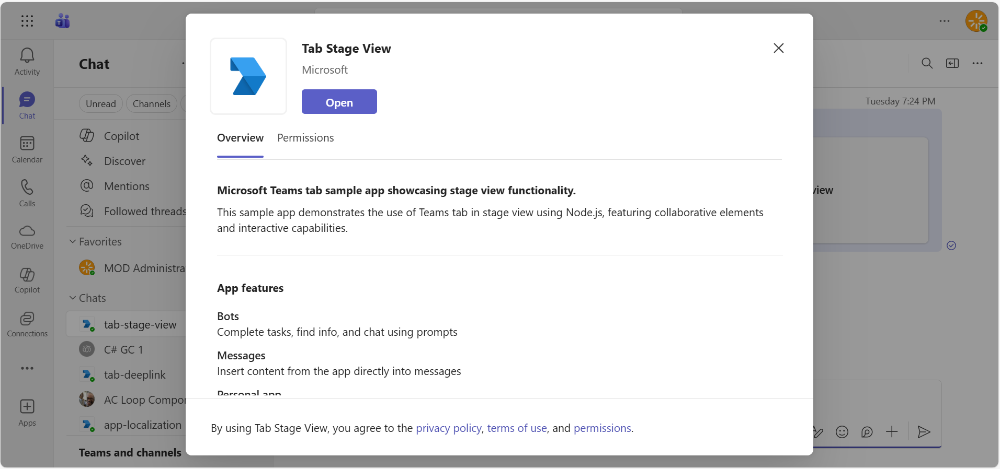

**Step 2: Open the App**

After installation, open the app from the Teams left sidebar to access the Stage View features.

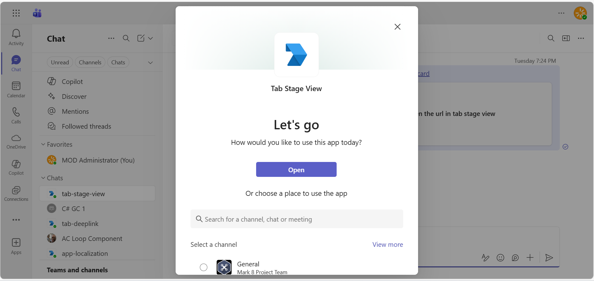

**Step 3: Welcome Card with Actions**

The bot sends a welcome message with an adaptive card containing action buttons to demonstrate Stage View capabilities.

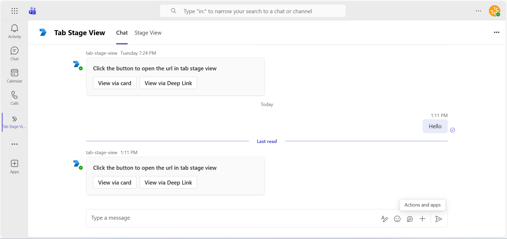

**Step 4: View via Card Action**

Click the "View via card" button to open the content in Stage View directly from the adaptive card action.

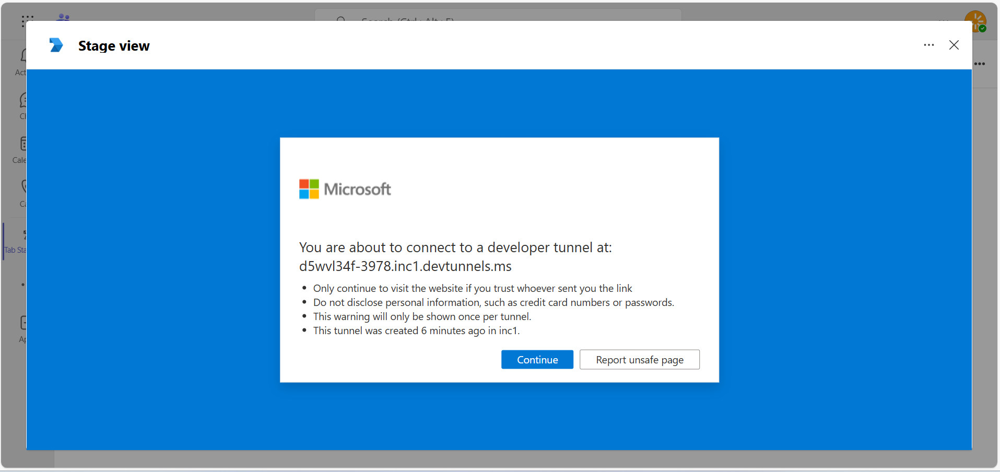

**Step 5: Stage View Content Display**

The Stage View opens showing the tab content in a focused, immersive experience within Teams.

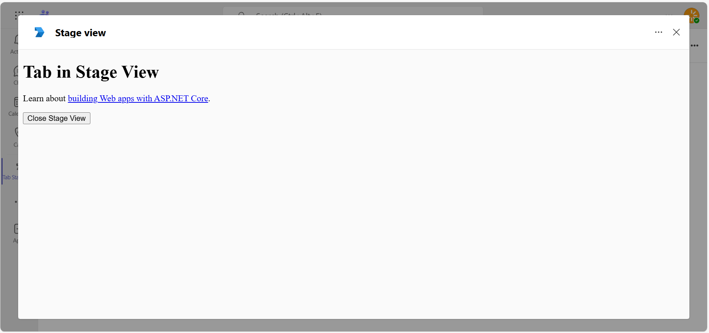

**Step 6: View via Deep Link**

Click the "View via Deep Link" button to open the Stage View using a Teams deep link URL.

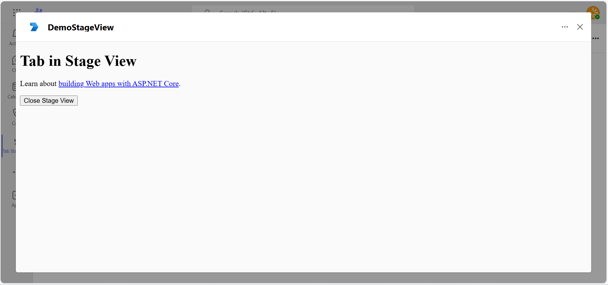

**Step 7: Link Unfurling Preview**

When you paste a URL from `https://tabstageview.com/card` in the compose message area, the bot unfurls the link and displays a preview card.

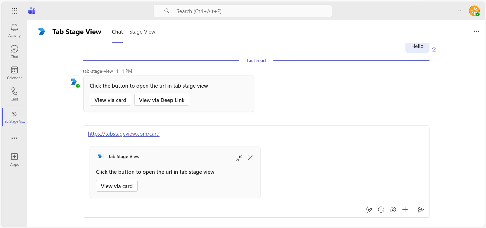

**Step 8: Link Unfurling Stage View**

Click on the unfurled card to open the content in Stage View, providing a seamless navigation experience.

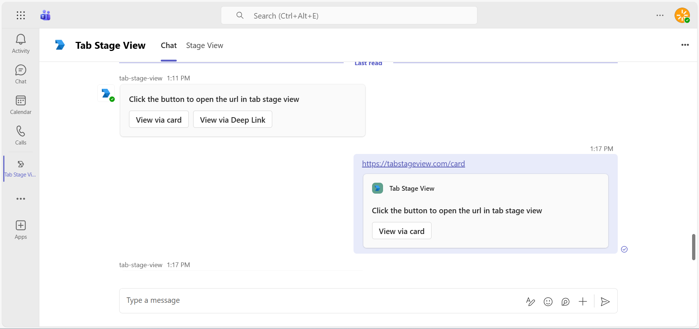

**Step 9: Tab Stage View**

Access the Stage View tab directly from the app's tab interface for a full-screen collaborative experience.

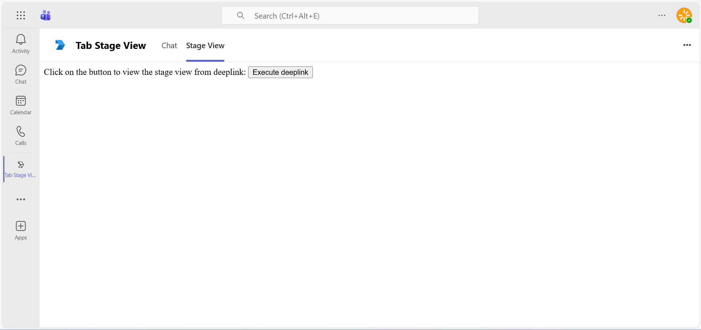

**Step 10: Stage View Tab Content**

The Stage View tab displays interactive content that can be shared and collaborated on with team members.

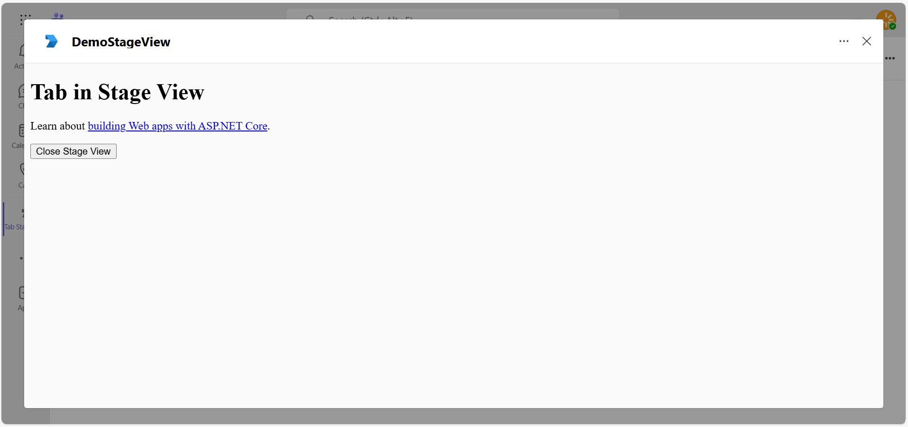

**Step 11: Collaborative Stage View with Chat**

The Collaborative Stage View feature allows users to view content while maintaining access to the chat panel for real-time discussions. Please refer [Collaborative Stage view](https://learn.microsoft.com/microsoftteams/platform/tabs/tabs-link-unfurling#collaborative-stage-view) for more details.

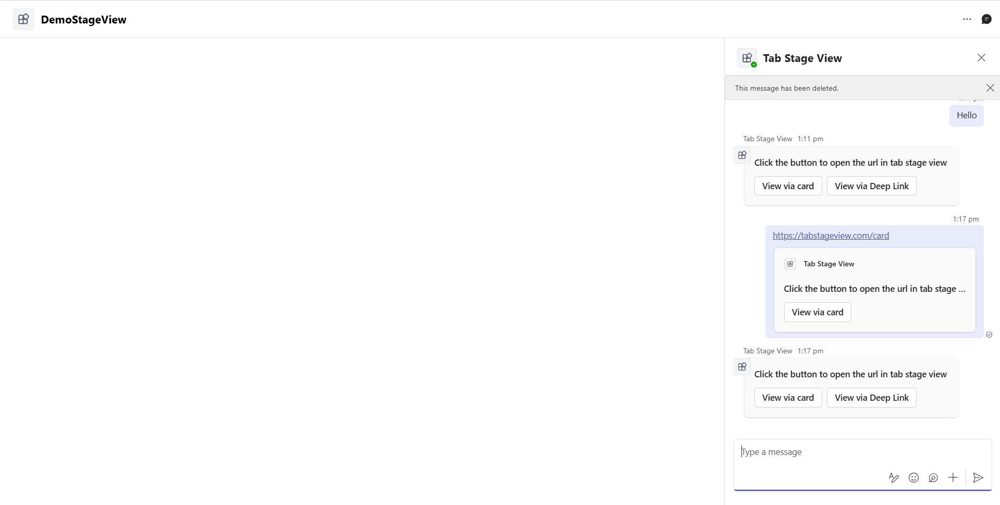

---

### Outlook Experience

**Step 1: Select the App in Outlook**

Navigate to Outlook on the web and select the Tab Stage View app from the available apps.

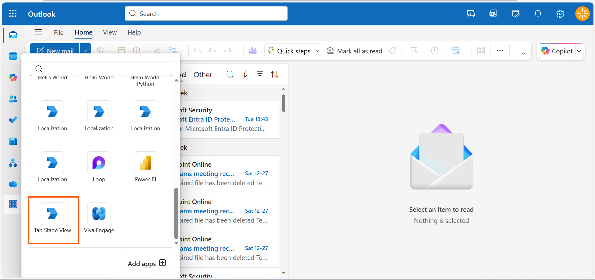

**Step 2: Continue with the App**

Click Continue to proceed with launching the app in Outlook.

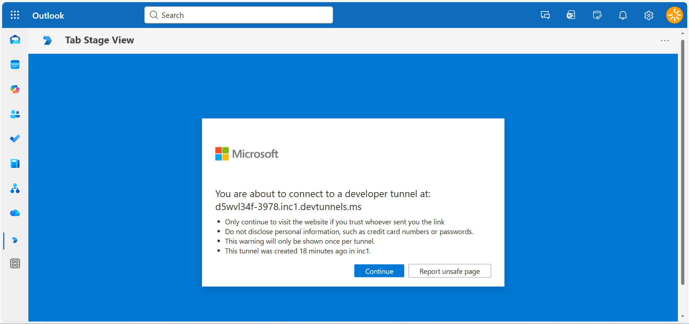

**Step 3: Execute Deep Link in Outlook**

Use the deep link functionality to open Stage View content directly within the Outlook experience.

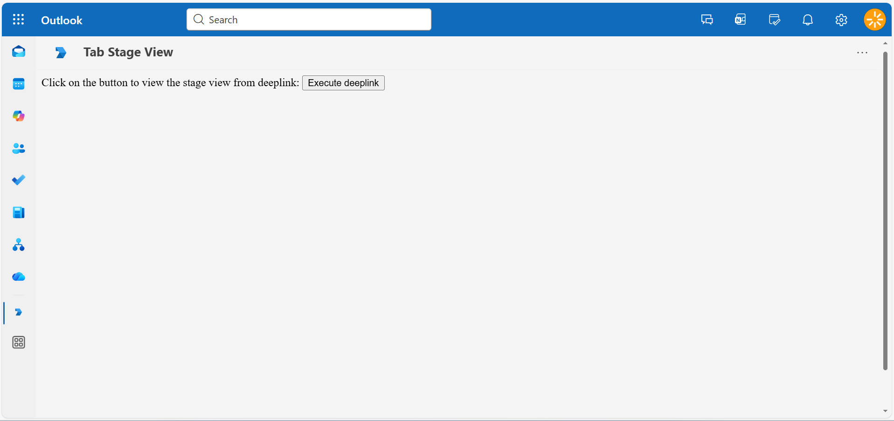

---

### Microsoft 365 Copilot Experience

**Step 1: Select the App in M365 Copilot**

Access the Tab Stage View app from the Microsoft 365 Copilot interface.

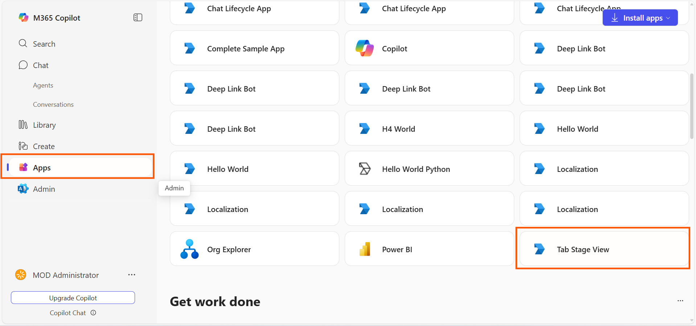

**Step 2: Continue with the App**

Click Continue to launch the app within the M365 Copilot environment.

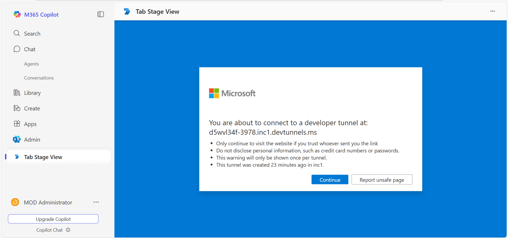

**Step 3: Tab Loaded in M365 Copilot**

The Stage View tab content is now loaded and ready for interaction within Microsoft 365 Copilot.

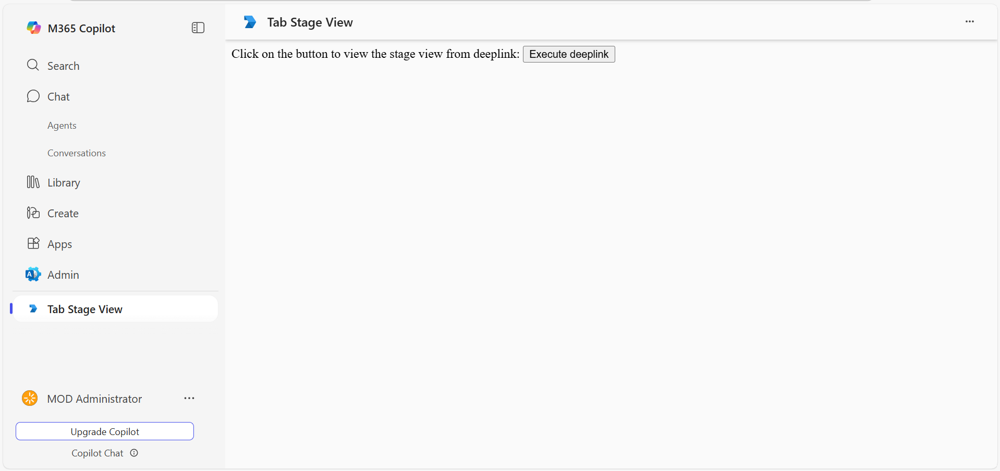

---

## Deploy to Azure

To learn more about deploying an agent to Azure, see [Deploy your agent to Azure](https://learn.microsoft.com/microsoftteams/platform/toolkit/deploy) for a complete list of deployment instructions.
- Ensure that you've [enabled the Teams Channel](https://docs.microsoft.com/azure/bot-service/channel-connect-teams?view=azure-bot-service-4.0)

## Further reading

- [Microsoft 365 Agents SDK](https://github.com/microsoft/agents)
- [Microsoft 365 Agents SDK for JavaScript](https://github.com/microsoft/agents-for-js)
- [Tabs](https://learn.microsoft.com/microsoftteams/platform/tabs/what-are-tabs)
- [Stage View](https://learn.microsoft.com/microsoftteams/platform/tabs/tabs-link-unfurling#stage-view)
- [Collaborative Stage View](https://learn.microsoft.com/microsoftteams/platform/tabs/tabs-link-unfurling#collaborative-stage-view)
- [Link Unfurling](https://learn.microsoft.com/microsoftteams/platform/messaging-extensions/how-to/link-unfurling)
- [Microsoft 365 Agents Toolkit](https://learn.microsoft.com/microsoftteams/platform/toolkit/teams-toolkit-fundamentals)


