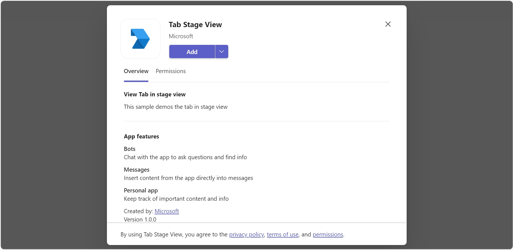
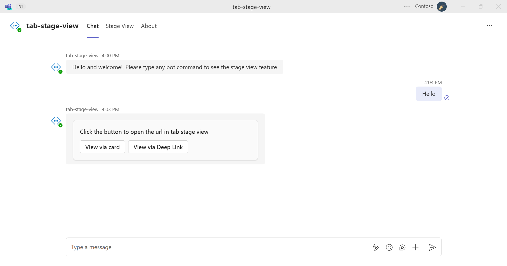
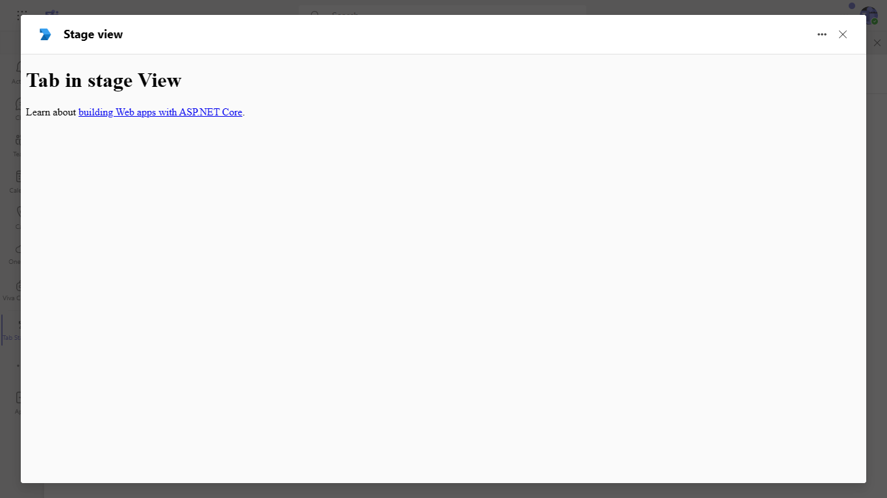
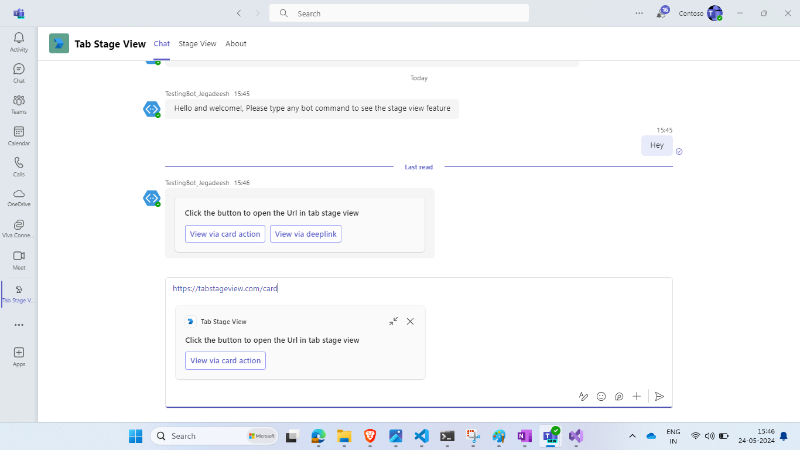

# Stage View

This sample app showcases the capabilities of Microsoft Teams tabs in stage view using Node.js. It demonstrates collaborative features such as multi-window support and interactive elements, allowing users to engage dynamically through adaptive cards and deep linking for a richer experience in Teams.
This App talks about the Teams tab in stage view with Nodejs.

For reference please check [Tabs link unfurling and Stage View](https://docs.microsoft.com/microsoftteams/platform/tabs/tabs-link-unfurling)

## Included Features
* Bots
* Stage View (tabs)
* Collaborative Stageview
* Stageview Multi-window (PopOut)
* Stageview Modal

## Interaction with app


## Try it yourself - experience the App in your Microsoft Teams client
Please find below demo manifest which is deployed on Microsoft Azure and you can try it yourself by uploading the app package (.zip file link below) to your teams and/or as a personal app. (Uploading must be enabled for your tenant, [see steps here](https://docs.microsoft.com/microsoftteams/platform/concepts/build-and-test/prepare-your-o365-tenant#enable-custom-teams-apps-and-turn-on-custom-app-uploading)).

**Stage View:** [Manifest](/samples/tab-stage-view/csharp/demo-manifest/tab-stage-view.zip)

## Prerequisites

- Office 365 tenant. You can get a free tenant for development use by signing up for the [Office 365 Developer Program](https://developer.microsoft.com/microsoft-365/dev-program).

- To test locally, [NodeJS](https://nodejs.org/en/download/) must be installed on your development machine (version 16.14.2 or higher).

    ```bash
    # determine node version
    node --version
    ```

- [dev tunnel](https://learn.microsoft.com/en-us/azure/developer/dev-tunnels/get-started?tabs=windows) or [Ngrok](https://ngrok.com/download) (For local environment testing) latest version (any other tunneling software can also be used)
   If you using Ngrok to test locally, you'll need [Ngrok](https://ngrok.com/) installed on your development machine.
Make sure you've downloaded and installed Ngrok on your local machine. ngrok will tunnel requests from the Internet to your local computer and terminate the SSL connection from Teams.

- [Microsoft 365 Agents Toolkit for VS Code](https://marketplace.visualstudio.com/items?itemName=TeamsDevApp.ms-teams-vscode-extension) or [TeamsFx CLI](https://learn.microsoft.com/microsoftteams/platform/toolkit/teamsfx-cli?pivots=version-one)

## Run the app (Using Microsoft 365 Agents Toolkit for Visual Studio Code)

The simplest way to run this sample in Teams is to use Microsoft 365 Agents Toolkit for Visual Studio Code.

1. Ensure you have downloaded and installed [Visual Studio Code](https://code.visualstudio.com/docs/setup/setup-overview)
1. Install the [Microsoft 365 Agents Toolkit extension](https://marketplace.visualstudio.com/items?itemName=TeamsDevApp.ms-teams-vscode-extension)
1. Select **File > Open Folder** in VS Code and choose this samples directory from the repo
1. Using the extension, sign in with your Microsoft 365 account where you have permissions to upload custom apps
1. Select **Debug > Start Debugging** or **F5** to run the app in a Teams web client.
1. In the browser that launches, select the **Add** button to install the app to Teams.

> If you do not have permission to upload custom apps (uploading), Microsoft 365 Agents Toolkit will recommend creating and using a Microsoft 365 Developer Program account - a free program to get your own dev environment sandbox that includes Teams.

## Setup

> NOTE: The free ngrok plan will generate a new URL every time you run it, which requires you to update your Azure AD registration, the Teams app manifest, and the project configuration. A paid account with a permanent ngrok URL is recommended.

1) Setup for Bot
    - Register a bot with Azure Bot Service, following the instructions [here](https://docs.microsoft.coms/azure/bot-service/bot-service-quickstart-registration?view=azure-bot-service-3.0).
    - While registering the bot, use `https://<your_tunnel_domain>/api/messages` as the messaging endpoint.
   
    > NOTE: When you create your app registration in Azure portal, you will create an App ID and App password - make sure you keep these for later.

2) App Registration

### Register your application with Azure AD

1. Register a new application in the [Microsoft Entra ID – App Registrations](https://go.microsoft.com/fwlink/?linkid=2083908) portal.
2. Select **New Registration** and on the *register an application page*, set following values:
    * Set **name** to your app name.
    * Choose the **supported account types** (any account type will work)
    * Leave **Redirect URI** empty.
    * Choose **Register**.
3. On the overview page, copy and save the **Application (client) ID, Directory (tenant) ID**. You'll need those later when updating your Teams application manifest and in the appsettings.json.
4. Navigate to **API Permissions**, and make sure to add the follow permissions:
    * Select Add a permission
    * Select Microsoft Graph -> Delegated permissions.
    * `User.Read` (enabled by default)
    * Click on Add permissions. Please make sure to grant the admin consent for the required permissions.

3) Setup NGROK
1) Run ngrok - point to port 3978

   ```bash
   ngrok http 3978 --host-header="localhost:3978"
   ```  

   Alternatively, you can also use the `dev tunnels`. Please follow [Create and host a dev tunnel](https://learn.microsoft.com/en-us/azure/developer/dev-tunnels/get-started?tabs=windows) and host the tunnel with anonymous user access command as shown below:

   ```bash
   devtunnel host -p 3978 --allow-anonymous
   ```

4) Setup for code    
- Clone the repository

    ```bash
    git clone https://github.com/OfficeDev/Microsoft-Teams-Samples.git
    ```

- In a console, navigate to `samples/tab-stage-view/nodejs` folder

- Install modules

    ```bash
    npm install
    ```

- Update the `.env` configuration for the bot to use the `MicrosoftAppId` (Microsoft App Id) and `MicrosoftAppPassword` (App Password) from the Azure bot registration in Azure portal or Bot Framework registration. 
Also update `BaseUrl` according to your code runtime environment.
> NOTE: the App Password is referred to as the `client secret` in the azure portal and you can always create a new client secret anytime.

- Run your bot at the command line:

    ```bash
    npm start
    ```
- Install modules & Run the NodeJS Server
  - Server will run on PORT: 3978
  - Open a terminal and navigate to project root directory
 
    ```bash
    npm run server
    ```
- This command is equivalent to: npm install > npm start

- Setup Manifest for Teams
5) **This step is specific to Teams.**

   -  Edit the `manifest.json` in the `appManifest` folder and replace the following details:
   - `<<MANIFEST-ID>>` with some unique GUID or `MicrosoftAppId`
   - `<<BASE-URL>>` with your application's base url, e.g. https://1234.ngrok-free.app
   - `<<YOUR-MICROSOFT-APP-ID>>` with the `MicrosoftAppId` received from Microsoft Entra ID app registration in Azure portal.
   - `<<DOMAIN-NAME>>` with the ngrok URL or app hosted base url.
   **Note:** If you want to test your app across multi hub like: Outlook/Office.com, please update the `manifest.json` in the `tab-stage-view\nodejs\appManifest_Hub` folder with the required values.
   - **Zip** up the contents of the `appManifest` folder to create a `Manifest.zip` or `appManifest_Hub` folder to create a `appManifest_Hub.zip`
   - **Upload** the `manifest.zip` to Teams (in the Apps view click "Upload a custom app")
         - Go to Microsoft Teams. From the lower left corner, select Apps
         - From the lower left corner, choose Upload a custom App
         - Go to your project directory, the ./appManifest folder, select the zip folder, and choose Open.
         - Select Add in the pop-up dialog box. Your tab is uploaded to Teams.

**Note**: If you are facing any issue in your app, please uncomment [this](https://github.com/OfficeDev/Microsoft-Teams-Samples/blob/main/samples/tab-stage-view/nodejs/server/api/botController.js#L24) line and put your debugger for local debug..

## Running the sample
- From Teams left side bar, select the ellipses ●●● and choose your app from the list.

**Install App:**



**Welcome message with feature explanation and Adaptive Card with actions:**



**Open the URL in tab stage view:**


 **Click view via card action:**


 **Click view via deeplink:**

    

**Opening Collaborative- Desktop Stage View**. Please refer [Collaborative Stage view](https://review.learn.microsoft.com/en-us/microsoftteams/platform/tabs/tabs-link-unfurling?branch=pr-en-us-7891#collaborative-stage-view) for more details.

 

  

  

**Opening stage view from Adaptive card via deep link:**


**Web Stage View:**



**Opening stage view from unfurling link. If you copy and paste a link from https://tabstageview.com/card into the compose message area, the link will unfurl.**



**Tab with execute deep link action to open stage view:**

         

**Click deep-link:**

    

## Outlook on the web

- To view your app in Outlook on the web.

- Go to [Outlook on the web](https://outlook.office.com/mail/)and sign in using your dev tenant account.

**On the side bar, select More Apps. Your uploaded app title appears among your installed apps**


**Select your app icon to launch and preview your app running in Outlook on the web**


**Note:** Similarly, you can test your application in the Outlook desktop app as well.

## Office on the web

- To preview your app running in Office on the web.

- Log into office.com with test tenant credentials

**Select the Apps icon on the side bar. Your uploaded app title appears among your installed apps**


**Select your app icon to launch your app in Office on the web**

 

**After opening Outlook web, click the "New mail" button.**


**On the tool bar on top, select Apps icon. Your uploaded app title appears among your installed apps**


**Opening stage view from unfurling link. If you copy and paste a link from https://tabstageview.com/card into the compose message area the link will unfurl.**


**Note:** Similarly, you can test your application in the Office 365 desktop app as well.

## Deploy the bot to Azure

To learn more about deploying a bot to Azure, see [Deploy your bot to Azure](https://aka.ms/azuredeployment) for a complete list of deployment instructions.
- Ensure that you've [enabled the Teams Channel](https://docs.microsoft.com/azure/bot-service/channel-connect-teams?view=azure-bot-service-4.0)

## Further reading

- [Tabs](https://learn.microsoft.com/microsoftteams/platform/tabs/what-are-tabs)
- [Stage view](https://learn.microsoft.com/microsoftteams/platform/tabs/tabs-link-unfurling#stage-view)

