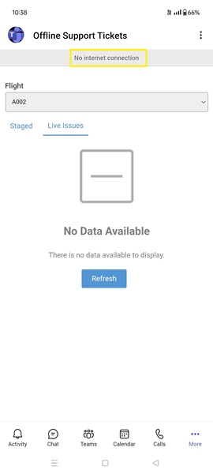
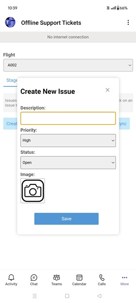
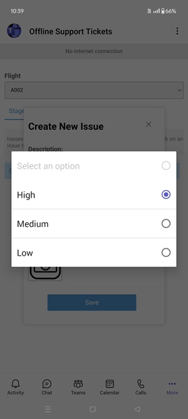
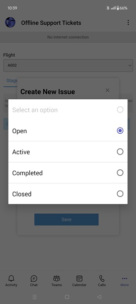
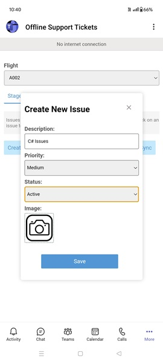
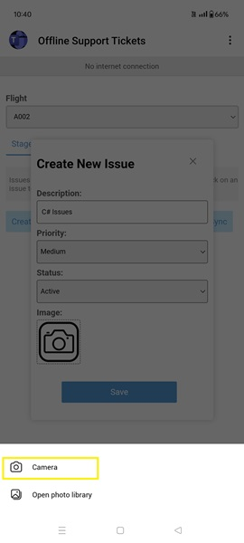
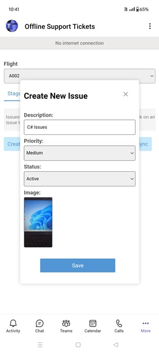
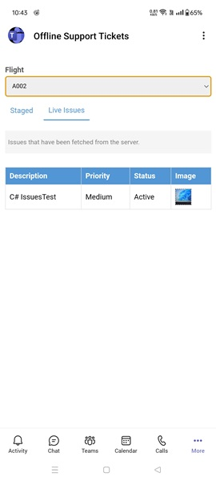

## Offline Support Tickets

This sample app illustrates a robust CRUD application that operates effectively offline within Microsoft Teams, empowering users to manage their data without internet access. Upon reconnection, the app automatically syncs local changes with blob storage, maintaining data integrity and providing a reliable solution for users in environments with intermittent connectivity.

**Interaction with app - Desktop**


**Interaction with app - Mobile**


## Try it yourself - experience the App in your Microsoft Teams client
Please find below demo manifest which is deployed on Microsoft Azure and you can try it yourself by uploading the app package (.zip file link below) to your teams and/or as a personal app. (Uploading must be enabled for your tenant, [see steps here](https://docs.microsoft.com/microsoftteams/platform/concepts/build-and-test/prepare-your-o365-tenant#enable-custom-teams-apps-and-turn-on-custom-app-uploading)).

**Microsoft Teams offline support tickets sample app:** [Manifest](/samples/tab-support-offline/nodejs/demo-manifest/tab-support-offline.zip)

## Prerequisites

- [NodeJS](https://nodejs.org/en/)
- [dev tunnel](https://learn.microsoft.com/en-us/azure/developer/dev-tunnels/get-started?tabs=windows) or [ngrok](https://ngrok.com/) latest version or equivalent tunnelling solution
- [VS Code](https://code.visualstudio.com/)
- [Blob Storage](https://learn.microsoft.com/en-us/azure/storage/blobs/storage-quickstart-blobs-portal)
- [Teams Toolkit for VS Code](https://marketplace.visualstudio.com/items?itemName=TeamsDevApp.ms-teams-vscode-extension) or [TeamsFx CLI](https://learn.microsoft.com/microsoftteams/platform/toolkit/teamsfx-cli?pivots=version-one)

## Run the app (Using Teams Toolkit for Visual Studio Code)

The simplest way to run this sample in Teams is to use Teams Toolkit for Visual Studio Code.

1. Ensure you have downloaded and installed [Visual Studio Code](https://code.visualstudio.com/docs/setup/setup-overview)
1. Install the [Teams Toolkit extension](https://marketplace.visualstudio.com/items?itemName=TeamsDevApp.ms-teams-vscode-extension)
1. Select **File > Open Folder** in VS Code and choose this samples directory from the repo
1. Using the extension, sign in with your Microsoft 365 account where you have permissions to upload custom apps
1. Select **Debug > Start Debugging** or **F5** to run the app in a Teams web client.
1. In the browser that launches, select the **Add** button to install the app to Teams.

> If you do not have permission to upload custom apps (uploading), Teams Toolkit will recommend creating and using a Microsoft 365 Developer Program account - a free program to get your own dev environment sandbox that includes Teams.

### Setup Register you app with Azure AD.

  1. Register a new application in the [Microsoft Entra ID – App Registrations](https://go.microsoft.com/fwlink/?linkid=2083908) portal.
  2. Select **New Registration** and on the *register an application page*, set following values:
      * Set **name** to your app name.
      * Choose the **supported account types** (any account type will work)
      * Leave **Redirect URI** empty.
      * Choose **Register**.
  3. On the overview page, copy and save the **Application (client) ID, Directory (tenant) ID**. You’ll need those later when updating your Teams application manifest and in the .env.
  4. Under **Manage**, select **Expose an API**. 
  5. Select the **Set** link to generate the Application ID URI in the form of `api://{base-url}/{AppID}`. Insert your fully qualified domain name (with a forward slash "/" appended to the end) between the double forward slashes and the GUID. The entire ID should have the form of: `api://fully-qualified-domain-name/{AppID}`
      * ex: `api://%ngrokDomain%.ngrok-free.app/00000000-0000-0000-0000-000000000000`.
  6. Select the **Add a scope** button. In the panel that opens, enter `access_as_user` as the **Scope name**.
  7. Set **Who can consent?** to `Admins and users`
  8. Fill in the fields for configuring the admin and user consent prompts with values that are appropriate for the `access_as_user` scope:
      * **Admin consent title:** Teams can access the user’s profile.
      * **Admin consent description**: Allows Teams to call the app’s web APIs as the current user.
      * **User consent title**: Teams can access the user profile and make requests on the user's behalf.
      * **User consent description:** Enable Teams to call this app’s APIs with the same rights as the user.
  9. Ensure that **State** is set to **Enabled**
  10. Select **Add scope**
      * The domain part of the **Scope name** displayed just below the text field should automatically match the **Application ID** URI set in the previous step, with `/access_as_user` appended to the end:
          * `api://[ngrokDomain].ngrok-free.app/00000000-0000-0000-0000-000000000000/access_as_user.
  11. In the **Authorized client applications** section, identify the applications that you want to authorize for your app’s web application. Each of the following IDs needs to be entered:
      * `1fec8e78-bce4-4aaf-ab1b-5451cc387264` (Teams mobile/desktop application)
      * `5e3ce6c0-2b1f-4285-8d4b-75ee78787346` (Teams web application)
  12. Navigate to **API Permissions**, and make sure to add the follow permissions:
  -   Select Add a permission
  -   Select Microsoft Graph -\> Delegated permissions.
      - `User.Read` (enabled by default)
      - `profile`
      - `openid`
      - `offline_access`
      - `email`
  -   Click on Add permissions. Please make sure to grant the admin consent for the required permissions.
  13.  Navigate to the **Certificates & secrets**. In the Client secrets section, click on "+ New client secret". Add a description(Name of the secret) for the secret and select “Never” for Expires. Click "Add". Once the client secret is created, copy its value, it need to be placed in the .env.

## Setup 

> Note these instructions are for running the sample on your local machine.

1. Run ngrok - point to port 3000

   ```bash
   ngrok http 3000 --host-header="localhost:3000"
   ```  

   Alternatively, you can also use the `dev tunnels`. Please follow [Create and host a dev tunnel](https://learn.microsoft.com/en-us/azure/developer/dev-tunnels/get-started?tabs=windows) and host the tunnel with anonymous user access command as shown below:

   ```bash
   devtunnel host -p 3000 --allow-anonymous
   ```

2. Clone the repository

    ```bash
    git clone https://github.com/OfficeDev/Microsoft-Teams-Samples.git
    ```
    
3. We have two different solutions to run, so follow below steps:
 
- In a terminal, navigate to `samples/tab-support-offline/nodejs/server` folder, Open your local terminal and run the below command to install node modules. You can do the same in Visual studio code terminal by opening the project in Visual studio code

    ```bash
    npx nodemon index
    ```
- The server will start running on 8080 port

- In a different terminal, navigate to `samples/tab-support-offline/nodejs/client` folder, Open your local terminal and run the below command to install node modules. You can do the same in Visual studio code terminal by opening the project in Visual studio code 

    ```bash
    npm run start
    ```
- The client will start running on 3000 port

4. Open blobStoreOperations.js file from this path folder `samples\tab-support-offline\nodejs\server\` and update:
   - `{{ account-Name }}` - Replace these values with your Azure Storage account details
   - `{{ container-Name }}`
   
**This step is specific to Teams:**

- **Edit** the manifest.json contained in the appManifest folder to replace every instance of the placeholder string `{{YOUR-MICROSOFT-APP-ID}}` with your Microsoft App Id (created during bot registration).

- **Edit** the `manifest.json` for `{{domain-name}}` with base Url domain. E.g. if you are using ngrok it would be `https://1234.ngrok-free.app` then your domain-name will be `1234.ngrok-free.app` and if you are using dev tunnels then your domain will be like: `12345.devtunnels.ms`.

- **Zip** up the contents of the `appManifest` folder to create a `manifest.zip` (Make sure that zip file does not contains any subfolder otherwise you will get error while uploading your .zip package)

- **Upload** the `manifest.zip` to Teams (In Teams Apps/Manage your apps click "Upload an app". Browse to and Open the .zip file. At the next dialog, click the Add button.)

- Add the app to personal static tabs.

## Desktop Running the sample

You can interact with Teams Tab meeting sidepanel.

**Install app:**


**Home Page:**


**Media Permission:**


**Create New Issues:**


**Create New Issues Details:**


**Issues Details Grid:**


**Create New Issues:**


**Issues Details Grid:**


**Sync:**


**Live Issues:**


**Flight Change:**


**Blob Container:**


## Mobile Running the sample:

**Install the app:**


**Turn off Wi-Fi and internet connection:**


**Home Page:**


**Flight Change:**


**Live Issues Page:**



**Create New Issues:**



**Priorty Change:**



**Status Change:**



**Create New Issues Details:**



**Select Camera:**



**Permissiom:**


**Camera Permission:**


**Create New Issues:**



**Issues Added Details:**


**Edit Issues:**


**Added/Updated Details:**


**Turn on Wi-Fi and internet connection:**


**Click Sync:**


**Details of Live Issues:**


**Flight Change:**


**Details of Live Issues:**




## Deploying

1. Build client `npm run build` 
2. Build command aboves moves `client/build`  folder to server directory
3. Deploy to Azure App Service

## Further reading

- [Tab](https://learn.microsoft.com/en-us/microsoftteams/platform/tabs/what-are-tabs?tabs=personal)
- [Create an Azure storage account](https://learn.microsoft.com/en-us/azure/storage/common/storage-account-create?tabs=azure-portal)

