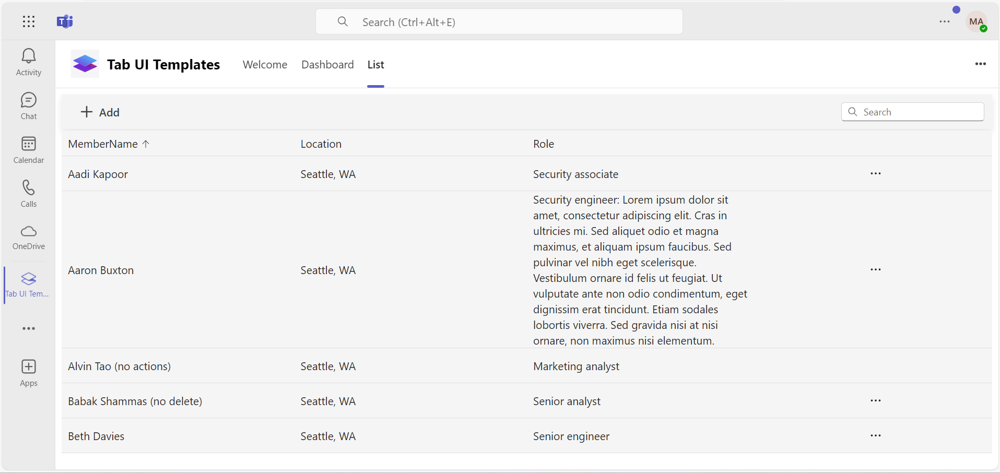
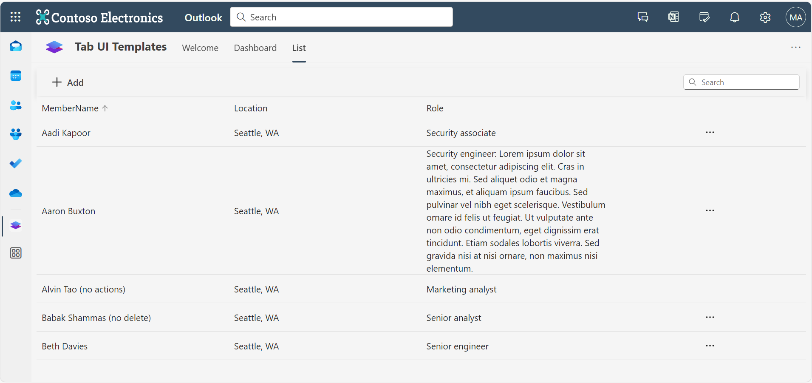

# Deploying the Microsoft Teams UI templates sample app

This sample app illustrates best practices for designing applications within Microsoft Teams, featuring a collection of high-quality UI templates that have been rigorously tested for various common use cases, including dashboards and forms. By leveraging these templates, developers can create visually appealing and user-friendly applications that enhance the overall Teams experience.

 ## Included Features
* Tabs
* UI Templates

## Interaction with tab


## Try it yourself - experience the App in your Microsoft Teams client
Please find below demo manifest which is deployed on Microsoft Azure and you can try it yourself by uploading the app package (.zip file link below) to your teams and/or as a personal app. (Uploading must be enabled for your tenant, [see steps here](https://docs.microsoft.com/microsoftteams/platform/concepts/build-and-test/prepare-your-o365-tenant#enable-custom-teams-apps-and-turn-on-custom-app-uploading)).

**Teams UI templates:** [Manifest](/samples/tab-ui-templates/ts/demo-manifest/tab-ui-templates.zip)

## Prerequisites

- <a href="https://git-scm.com/" target="_blank">Install Git</a>
- [Node.js and npm](https://nodejs.org). Run the command `node --version` to verify that Node.js is installed.
- Set up a [Microsoft 365 developer account](https://docs.microsoft.com/microsoftteams/platform/build-your-first-app/build-first-app-overview#set-up-your-development-account), which allows app uploading in Teams.
- [Microsoft 365 Agents Toolkit for VS Code](https://marketplace.visualstudio.com/items?itemName=TeamsDevApp.ms-teams-vscode-extension) or [TeamsFx CLI](https://learn.microsoft.com/microsoftteams/platform/toolkit/teamsfx-cli?pivots=version-one)

## Set up your app project

Open a terminal and clone the sample app repository.

```bash
git clone https://github.com/OfficeDev/Microsoft-Teams-Samples.git
cd Microsoft-Teams-Samples/samples/tab-ui-templates/ts
yarn install
```

You can find the app source code in `./src`:

- `app`: Includes the app scaffolding.

- `appManifest`: Includes the app manifest (`manifest.json`) and the color and outline versions of the app icon.

- `assets`: Includes the app assets.


## Run the app (Using Microsoft 365 Agents Toolkit for Visual Studio Code)

The simplest way to run this sample in Teams is to use Microsoft 365 Agents Toolkit for Visual Studio Code.

1. Ensure you have downloaded and installed [Visual Studio Code](https://code.visualstudio.com/docs/setup/setup-overview)
1. Install the [Microsoft 365 Agents Toolkit extension](https://marketplace.visualstudio.com/items?itemName=TeamsDevApp.ms-teams-vscode-extension)
1. Select **File > Open Folder** in VS Code and choose this samples directory from the repo
1. Using the extension, sign in with your Microsoft 365 account where you have permissions to upload custom apps
1. Select **Debug > Start Debugging** or **F5** to run the app in a Teams web client.
1. In the browser that launches, select the **Add** button to install the app to Teams.

> If you do not have permission to upload custom apps (uploading), Microsoft 365 Agents Toolkit will recommend creating and using a Microsoft 365 Developer Program account - a free program to get your own dev environment sandbox that includes Teams.

## Run the app (Manually Uploading to Teams)

1. In the root directory of your project, run the following command.

   ```bash
   yarn start
   ```

   When the app starts, you should see the following terminal output.

   ```
     You can now view microsoft-teams-app-sample in the browser.
       Local:            http://localhost:3978
       On Your Network:  http://192.168.0.10:3978
   ```

2. Open a browser and verify that all of the following URLs load:
   - **Required Teams app pages**:
     - About: [http://localhost:3978](http://localhost:3978)
     - Privacy: [http://localhost:3978/#/privacy](http://localhost:3978/#/privacy)
     - Terms of use: [http://localhost:3978/#/termsofuse](http://localhost:3978/#/termsofuse)
   - **Sample app tabs**:
     - [http://localhost:3978/#/welcome](http://localhost:3978/#/welcome)
     - [http://localhost:3978/#/dashboard](http://localhost:3978/#/dashboard)
     - [http://localhost:3978/#/list](http://localhost:3978/#/list)
     - [http://localhost:3978/#/board](http://localhost:3978/#/board)

## Set up a secure tunnel to the app

Teams doesn't display app content unless it's accessible via HTTPS. We recommend using ngrok to establish a secure tunnel to where you're hosting the app locally (for example, `http://localhost:3978`).

1. Install [dev tunnel](https://learn.microsoft.com/en-us/azure/developer/dev-tunnels/get-started?tabs=windows) or [ngrok](https://ngrok.com/download) latest version or equivalent tunneling solution

1. Run ngrok - point to port 3978

   ```bash
   ngrok http 3978 --host-header="localhost:3978"
   ```  

   Alternatively, you can also use the `dev tunnels`. Please follow [Create and host a dev tunnel](https://learn.microsoft.com/en-us/azure/developer/dev-tunnels/get-started?tabs=windows) and host the tunnel with anonymous user access command as shown below:

   ```bash
   devtunnel host -p 3978 --allow-anonymous
   ```

1. Save the HTTPS URL in the output (for example, https://468b9ab725e9.ngrok-free.app). You may need this later if you plan to register the app with App Studio.

> [!IMPORTANT]
> If you're using the free version of ngrok and plan to share the app with others, remember that ngrok quits if your machine shuts down or goes to sleep. When you restart ngrok, the URL also will be different. (A paid version of ngrok provides persistent URLs.)

### Register your app with Azure AD.

1. Register a new application in the [Microsoft Entra ID – App Registrations](https://go.microsoft.com/fwlink/?linkid=2083908) portal.
2. Select **New Registration** and on the *register an application page*, set following values:
    * Set **name** to your app name.
    * Choose the **supported account types** (any account type will work)
    * Leave **Redirect URI** empty.
    * Choose **Register**.
3. On the overview page, copy and save the **Application (client) ID, Directory (tenant) ID**. You'll need those later when updating your Teams application manifest and in the appsettings.json.
4. Navigate to **API Permissions**, and make sure to add the follow permissions:
    * Select Add a permission
    * Select Microsoft Graph -> Delegated permissions.
    * `User.Read` (enabled by default)
    * Click on Add permissions. Please make sure to grant the admin consent for the required permissions.

## Create the app package
1) __*This step is specific to Teams.*__
    - **Edit** the `manifest.json` contained in the  `src/appManifest` folder to replace `<<GUID_ID>>` with any GUID value.
    - **Edit** the `manifest.json` for `staticTabs` inside the `contentUrl` replace `<<HOSTNAME>>` with base Url domain. E.g. if you are using ngrok it would be `https://1234.ngrok-free.app` then your domain-name will be `1234.ngrok-free.app` and if you are using dev tunnels then your domain will be like: `12345.devtunnels.ms`. Replace the same value for `<<HOSTNAME>>` inside `validDomains` section.
    - **Note:** If you want to test your app across multi hub like: Outlook/Office.com, please update the `manifest.json` in the `tab-ui-templates\ts\src\appManifest_Hub` folder with the required values.
    - **Zip** up the contents of the `Manifest` folder to create a `Manifest.zip` or `appManifest_Hub` folder to create a `appManifest_Hub.zip` (Make sure that zip file does not contains any subfolder otherwise you will get error while uploading your .zip package)
    - **Upload** the `manifest.zip` to Teams (In Teams Apps/Manage your apps click "Upload an app". Browse to and Open the .zip file. At the next dialog, click the Add button.)
    - Add the app to personal scope.


## Upload the app in Teams

1. In the Teams client, go to **Apps**.

1. Select **Upload a custom app** and upload the app package, which is the generated `zip` file in the `package` folder.

   

## Running the sample

- Welcome Page


- Dashboard Page


- List Page


## Outlook on the web

- To view your app in Outlook on the web.

- Go to [Outlook on the web](https://outlook.office.com/mail/)and sign in using your dev tenant account.

**On the side bar, select More Apps. Your uploaded app title appears among your installed apps**


**Select your app icon to launch and preview your app running in Outlook on the web**




**Note:** Similarly, you can test your application in the Outlook desktop app as well.

## Office on the web

- To preview your app running in Office on the web.

- Log into office.com with test tenant credentials

**Select the Apps icon on the side bar. Your uploaded app title appears among your installed apps**


**Select your app icon to launch your app in Office on the web**

 

 


 
**Note:** Similarly, you can test your application in the Office 365 desktop app as well.

## Next steps

- Design your Teams app with [UI templates](https://docs.microsoft.com/microsoftteams/platform/concepts/design/design-teams-app-ui-templates).
- Implement UI templates with the [Microsoft Teams UI Library](https://www.npmjs.com/package/@fluentui/react-teams).

 ## Further reading

- [Tabs](https://learn.microsoft.com/microsoftteams/platform/tabs/what-are-tabs)
- [Extend Teams apps across Microsoft 365](https://learn.microsoft.com/microsoftteams/platform/m365-apps/overview)

