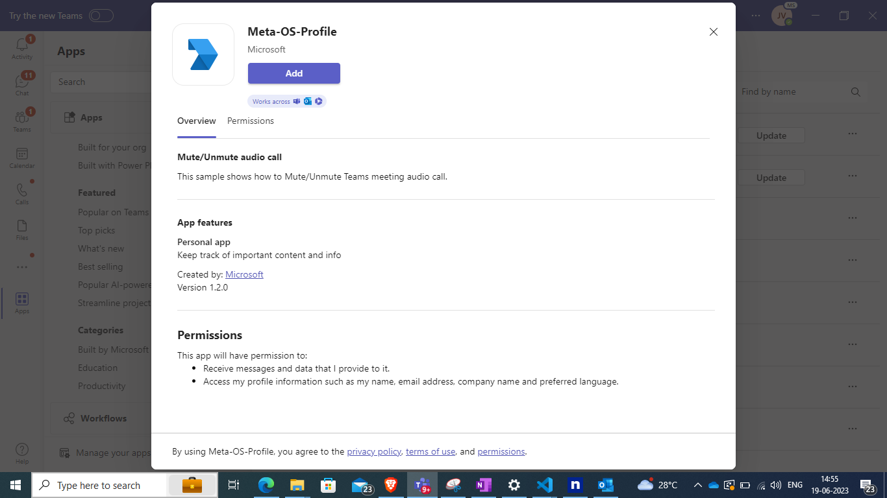
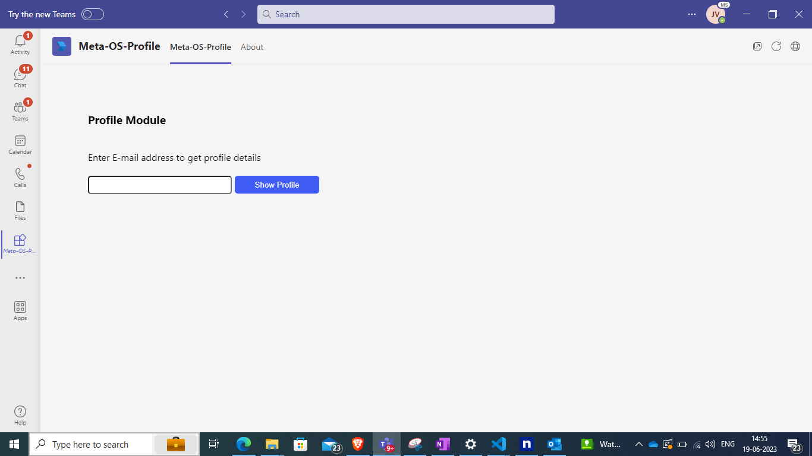
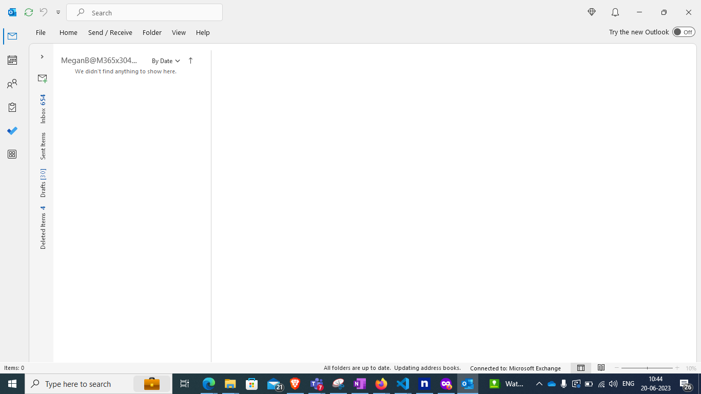
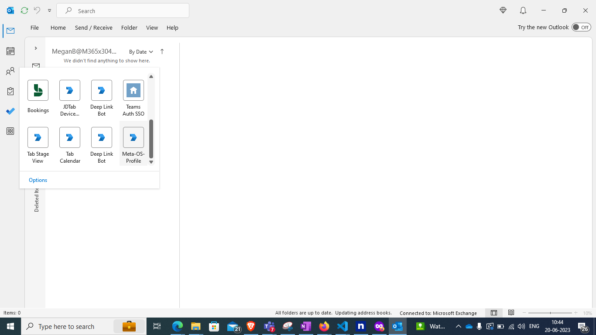
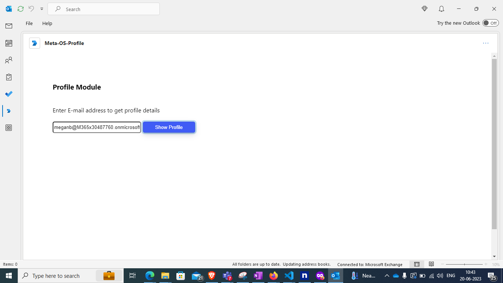
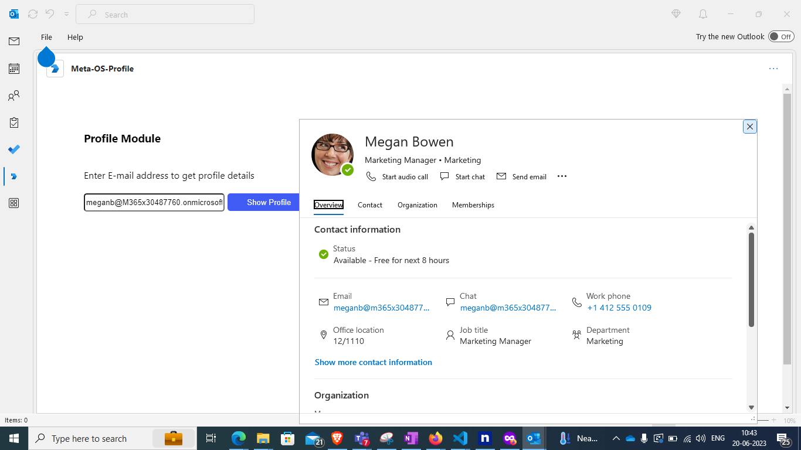

# profile

Opens a profile card at a specified position to show profile information about a persona.

 ## Included Features
* Tabs

## Interaction with app


## Prerequisites
-  [NodeJS](https://nodejs.org/en/)

-  [M365 developer account](https://docs.microsoft.com/en-us/microsoftteams/platform/concepts/build-and-test/prepare-your-o365-tenant) or access to a Teams account with the appropriate permissions to install an app.
- [Ngrok](https://ngrok.com/download) (For local environment testing) Latest (any other tunneling software can also be used)
  
- [Teams](https://teams.microsoft.com) Microsoft Teams is installed and you have an account

## Setup
    
1. Setup NGROK
  - Run ngrok - point to port 3978

    ```bash
    ngrok http 3978 --host-header="localhost:3978"
    ```
2. Setup for code
 - Clone the repository

    ```bash
    git clone https://github.com/OfficeDev/Microsoft-Teams-Samples.git
    ```

-  In a terminal, navigate to `samples/tab-user-profile/ts`

 - Install modules

    ```bash
    npm install
    ```
 - Run your app

    ```bash
    npm start
    ```
3. Setup Manifest for Teams

- **This step is specific to Teams.**
    **Edit** the `manifest.json` contained in the `Manifest/` folder to replace with any GUID *everywhere* you see the place holder string `{{Manifest-Id}}`.
    **Edit** the `manifest.json` for `validDomains` and replace `{{domain-name}}` with base Url of your domain. E.g. if you are using ngrok it would be `https://1234.ngrok-free.app` then your domain-name will be `1234.ngrok-free.app`.
    **Zip** up the contents of the `Manifest/` folder to create a `manifest.zip`.
    **Upload** the `manifest.zip` to Teams (in the left-bottom *Apps* view, click "Upload a custom app")


## Running the sample

**Install App:**



**Meta OS Profile UI:**



**Profile API will only work on Outlook client application. Once app installed in teams open Outlook client app.**



**On the sidebar, select More Apps. Your sideloaded app title appears among your installed apps**



**Open the app , now the app tab will appear. Enter any Email to get  a profile card at a specified position to show profile information about that persona**






## Further Reading.
- [TeamsJS capability support across Microsoft 365](https://learn.microsoft.com/en-us/microsoftteams/platform/m365-apps/teamsjs-support-m365#profile)
- [Extend Teams apps across Microsoft 365](https://learn.microsoft.com/microsoftteams/platform/m365-apps/overview)


