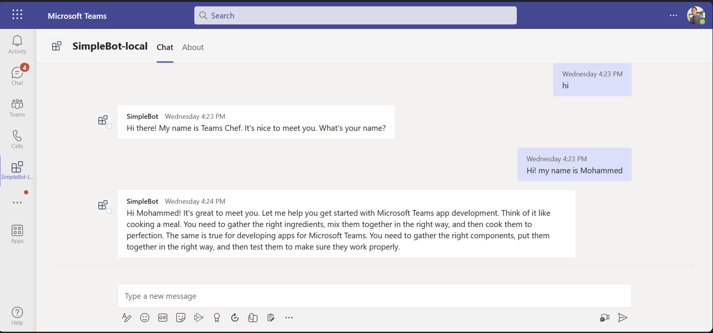
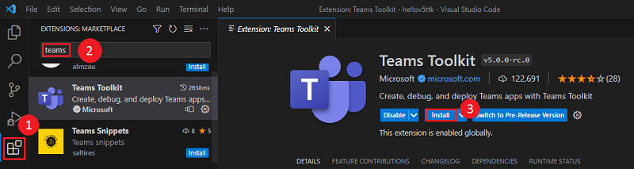

# Teams AI Library Bot

You can create a conversational bot for Microsoft Teams that thinks it's a Chef to help you cook Teams apps and illustrates basic conversational bot behavior in Microsoft Teams. The bot is built to allow GPT to facilitate the conversation on its behalf, using only a natural language prompt file to guide it.

## Interaction with botss


## Prerequisites

- [Node.js](https://nodejs.org/), supported versions: 16, 18
- An M365 account. If you do not have M365 account, apply one from [M365 developer program](https://developer.microsoft.com/en-us/microsoft-365/dev-program)
- [Teams Toolkit Visual Studio Code Extension](https://aka.ms/teams-toolkit) version 5.0.0 and higher or [TeamsFx CLI](https://aka.ms/teamsfx-cli)
- [OpenAI](https://platform.openai.com/docs/quickstart/build-your-application)

## ToolKit Installation

- Open Visual Studio Code and select the Extensions view (Ctrl+Shift+X / ⌘⇧-X or View > Extensions).

- In the search box, enter Teams Toolkit.

- Select Install next to the Teams Toolkit.
  

- The Teams Toolkit icon appears in the Visual Studio Code Activity Bar after it's installed.

- Sign in to your Microsoft 365 account to view this option. This process is known as sideloading.
  

- From Visual Studio Code: Start debugging the project by hitting the `F5` key in Visual Studio Code.
- Alternatively use the `Run and Debug Activity Panel` in Visual Studio Code and click the `Run and Debug` green arrow button.
- From TeamsFx CLI:
  - Install [ngrok](https://ngrok.com/download) and start your local tunnel service by running the command `ngrok http 3978`.
  - In the `env/.env.local` file, fill in the values for `BOT_DOMAIN` and `BOT_ENDPOINT` with your ngrok URL.
    ```
    BOT_DOMAIN=sample-id.ngrok.io
    BOT_ENDPOINT=https://sample-id.ngrok.io
    ```
  - Executing the command `teamsfx provision --env local` in your project directory.
  - Executing the command `teamsfx deploy --env local` in your project directory.
  - Executing the command `teamsfx preview --env local` in your project directory.

## Edit the manifest

You can find the Teams app manifest in `./appPackage` folder. The folder contains one manifest file:
* `manifest.json`: Manifest file for Teams app running locally or running remotely (After deployed to Azure).

This file contains template arguments with `${{...}}` statements which will be replaced at build time. You may add any extra properties or permissions you require to this file. See the [schema reference](https://docs.microsoft.com/en-us/microsoftteams/platform/resources/schema/manifest-schema) for more information.

## Deploy to Azure

Deploy your project to Azure by following these steps:

| From Visual Studio Code                                                                                                                                                                                                                                                                                                                                                  | From TeamsFx CLI                                                                                                                                                                                                                    |
| :----------------------------------------------------------------------------------------------------------------------------------------------------------------------------------------------------------------------------------------------------------------------------------------------------------------------------------------------------------------------- | :---------------------------------------------------------------------------------------------------------------------------------------------------------------------------------------------------------------------------------- |
| <ul><li>Open Teams Toolkit, and sign into Azure by clicking the `Sign in to Azure` under the `ACCOUNTS` section from sidebar.</li> <li>After you signed in, select a subscription under your account.</li><li>Open the Teams Toolkit and click `Provision` from DEPLOYMENT section or open the command palette and select: `Teams: Provision`.</li><li>Open the Teams Toolkit and click `Deploy` or open the command palette and select: `Teams: Deploy`.</li></ul> | <ul> <li>Run command `teamsfx account login azure`.</li> <li>Run command `teamsfx provision --env dev`.</li> <li>Run command: `teamsfx deploy --env dev`. </li></ul> |

> Note: Provisioning and deployment may incur charges to your Azure Subscription.

## Preview

Once the provisioning and deployment steps are finished, you can preview your app:

- From Visual Studio Code

  1. Open the `Run and Debug Activity Panel`.
  1. Select `Launch Remote (Edge)` or `Launch Remote (Chrome)` from the launch configuration drop-down.
  1. Press the Play (green arrow) button to launch your app - now running remotely from Azure.

- From TeamsFx CLI: execute `teamsfx preview --env dev` in your project directory to launch your application.

## Validate manifest file

To check that your manifest file is valid:

- From Visual Studio Code: open the command palette and select: `Teams: Validate Application`.
- From TeamsFx CLI: run command `teamsfx validate` in your project directory.

## Package

- From Visual Studio Code: open the Teams Toolkit and click `Zip Teams App Package` or open the command palette and select `Teams: Zip Teams App Package`.
- Alternatively, from the command line run `teamsfx package` in the project directory.

## Publish to Teams

Once deployed, you may want to distribute your application to your organization's internal app store in Teams. Your app will be submitted for admin approval.

- From Visual Studio Code: open the Teams Toolkit and click `Publish` or open the command palette and select: `Teams: Publish`.
- From TeamsFx CLI: run command `teamsfx publish` in your project directory.

## Further reading

- [Build your first app using Teams AI library](https://review.learn.microsoft.com/en-us/microsoftteams/platform/sbs-botbuilder-conversation-ai?branch=pr-en-us-8376&tabs=vscode%2Cviscode)

### Bot

- [Bot Basics](https://docs.microsoft.com/azure/bot-service/bot-builder-basics?view=azure-bot-service-4.0)
- [Bot Framework Documentation](https://docs.botframework.com/)
- [Azure Bot Service Introduction](https://docs.microsoft.com/azure/bot-service/bot-service-overview-introduction?view=azure-bot-service-4.0)