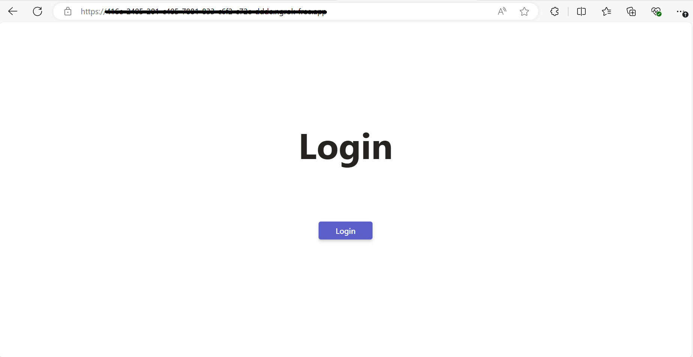
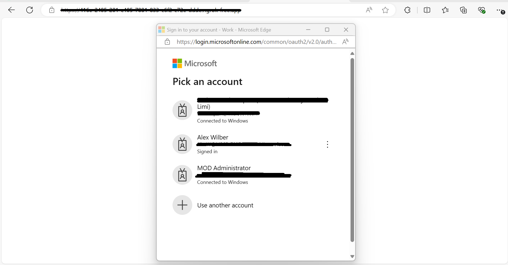
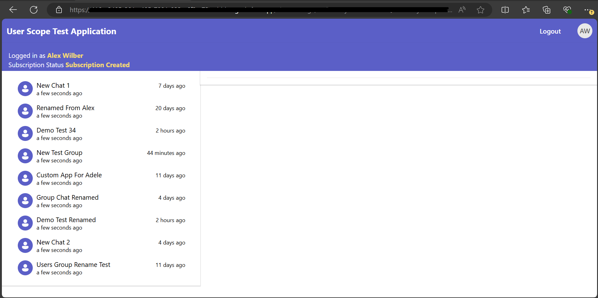

# User Scope Change Notifications Using Microsoft Graph API In Node.js

This sample application uses Microsoft Graph API to notify users of team or channel changes, such as creation, editing, or deletion. It supports Graph API, MSAL authentication, and user-scope notifications in a Node.js web app.

## Included Features
* Graph API
* Web Application
* MSAL Authentication
* User-Scope Graph Notifications

## Interaction with Tab


## Prerequisites

- Microsoft Teams is installed and you have an account (not a guest account)
-  [NodeJS](https://nodejs.org/en/)
-  [dev tunnel](https://learn.microsoft.com/en-us/azure/developer/dev-tunnels/get-started?tabs=windows) or [ngrok](https://ngrok.com/download) latest version or equivalent tunneling solution
-  [M365 developer account](https://docs.microsoft.com/en-us/microsoftteams/platform/concepts/build-and-test/prepare-your-o365-tenant) or access to a Teams account with the appropriate permissions to install an app.

**Note:** Please create and install self-signed certificate before running this sample using toolkit or manually.

## Setup

> Note these instructions are for running the sample on your local machine.

1) Run ngrok - point to port 3978

   ```bash
   ngrok http 3978 --host-header="localhost:3978"
   ```  

   Alternatively, you can also use the `dev tunnels`. Please follow [Create and host a dev tunnel](https://learn.microsoft.com/en-us/azure/developer/dev-tunnels/get-started?tabs=windows) and host the tunnel with anonymous user access command as shown below:

   ```bash
   devtunnel host -p 3978 --allow-anonymous
   ```

2) App Registration

### Register your application with Azure AD

1. Register a new application in the [Microsoft Entra ID – App Registrations](https://go.microsoft.com/fwlink/?linkid=2083908) portal.
2. Select **New Registration** and on the *register an application page*, set following values:
    * Set **name** to your app name.
    * Choose the **supported account types** (any account type will work)
    * Leave **Redirect URI** empty.
    * Choose **Register**.
3. On the overview page, copy and save the **Application (client) ID, Directory (tenant) ID**. You'll need those later when updating your Teams application manifest and in the appsettings.json.
4. Navigate to **API Permissions**, and make sure to add the follow permissions:
    * Select Add a permission
    * Select Microsoft Graph -> Delegated permissions.
    * `User.Read` (enabled by default)
    * Click on Add permissions. Please make sure to grant the admin consent for the required permissions.

### Create and install Self-Signed certificate

To include resource data of graph notifications, this Graph API require self-signed certificate. Follow the below steps to create and manage certificate.

1. You can self-sign the certificate, since Microsoft Graph does not verify the certificate issuer, and uses the public key for only encryption.

2. Use [Azure Key Vault](https://docs.microsoft.com/en-us/azure/key-vault/key-vault-whatis) as the solution to create, rotate, and securely manage certificates. Make sure the keys satisfy the following criteria:

    - The key must be of type `RSA`
    - The key size must be between 2048 and 4096 bits

3. Follow this documentation for the steps - [**Create and install Self-Signed certificate**](CertificateDocumentation/README.md)


4. Clone the repository

    ```bash
    git clone https://github.com/OfficeDev/Microsoft-Teams-Samples.git
    ```

 A) If you are using Visual Studio Code

  - Launch Visual Studio code
  - File -> Open Folder
  - Navigate to `samples/user-scope-web-application` folder.
  - Select `nodejs` folder.

  **Instruction for .env**
    1. Provide Update configuration with the ```MicrosoftAppId```, ```MicrosoftAppPassword```, ```MicrosoftAppTenantId```,
       ```Base64EncodedCertificate```, ```EncryptionCertificateId```, ```PRIVATE_KEY_PATH``` in the .env that is created in Azure.
    2. Provide the tunnel url as  "BaseUrl" in appsetting on which application is running on.
    3. You should be having Base64EncodedCertificate from *Create and install Self-Signed certificate* step.
    4. Use Certificate "PEM" format and add the certificate name for `PRIVATE_KEY_PATH` For eg  `PRIVATE_KEY_PATH`=PrivateKeyFileName.pem" in .env file. Also make sure the private key file is stored inside helper folder of this project.
    **Note** : ```notificationUrl``` will be updated automatically from `teamsapp.local.yml` file when you run application by teams toolkit. And when you run locally through `npm start` then your notificationUrl will be like : `https://1234.ngrok-free.app/api/notifications` and if you are using dev tunnels, your notificationUrl will be like: `https://12345.devtunnels.ms/api/notifications`.   

   
   **Update For MicrosoftftAppId In sample code**
        1. Navigate to `samples/user-scope-web-application/client/src/components/login.jsx` file and update `<<Microsoft-App-Id>>` with your MicrosoftAppID at line number 20.
        2. Navigate to `samples/user-scope-web-application/client/src/components/userScopeTestApp.jsx` file and update `<<Microsoft-App-Id>>` with your MicrosoftAppID at line number 31.
   

  - Install node modules

    Inside node js folder, open your local terminal and run the below command to install node modules. You can do the same for client folder by opening the project in Visual Studio code.

    ```bash
    npm install
    ```

    Run your app

    ```bash
     npm start
    ```  

## Running the sample

You can interact with user scope web application by logging with demo tenant.

## User Scope Graph API Notifications

1. **Installation To Group Chat**


1. **Select Account**


1. **Successfull login**


1. **Group chat and messages**


## Further reading
- [Change notifications for Microsoft Teams channel](https://docs.microsoft.com/en-us/graph/teams-changenotifications-team-and-channel)
- [Create subscription permissions for supported resource](https://docs.microsoft.com/en-us/graph/api/subscription-post-subscriptions?view=graph-rest-1.0&tabs=http#team-channel-and-chat)
- [Get change notifications for chats using Microsoft Graph](https://review.learn.microsoft.com/en-us/graph/teams-changenotifications-chat?branch=main&branchFallbackFrom=pr-en-us-24192)


