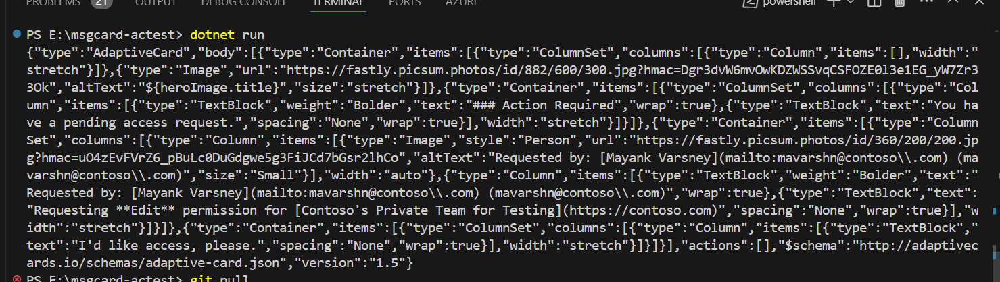
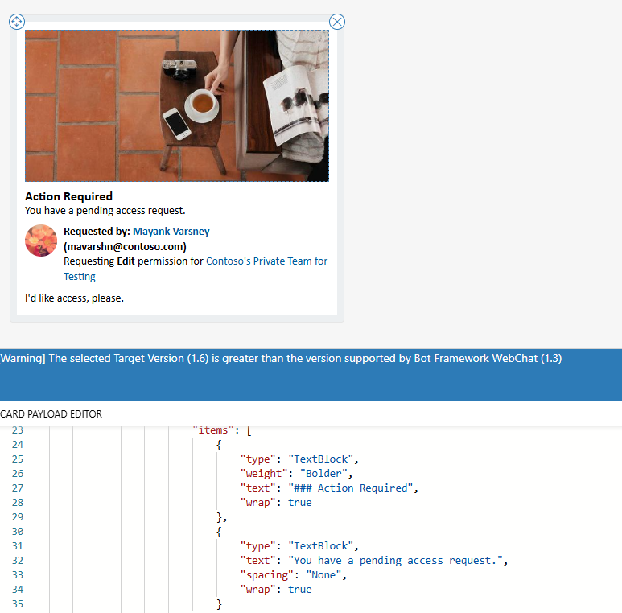

## Summary

This sample shows how to consume `actemplate.json` for reasonably transforming Legacy Message Cards to Adaptive Cards.
> ### **Note**
This tool is not production-ready and does best effort transformation. Use it with caution and thoroughly test card rendering before deploying it in Bots or Workflows. Additionally, be aware that HTTP POST Actions are not supported.
Please exercise due diligence and consider the limitations mentioned above when using this tool.

## Set up instructions

 - This sample is targeting the .NET 8.0 Runtime.
 - Please install the SDK from the official link: https://dotnet.microsoft.com/en-us/download/dotnet/8.0
 - Open the `msgcard-actest.csproj` with Visual Studio or Visual Studio Code.
 - Edit the msgcard.json and update it with your payload conforming to Message Card format.
 - Run `dotnet run` and you will see the transformed AC for the `msgcard.json` in the console.
 - Copy the output and preview in AC designer https://adaptivecards.io/designer/ or using Adaptive Card Previewer extension in VS Code.

## Sample Run

